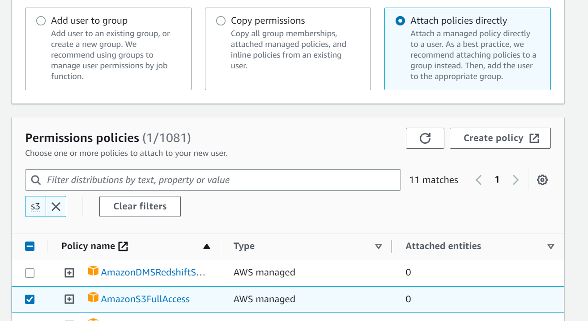
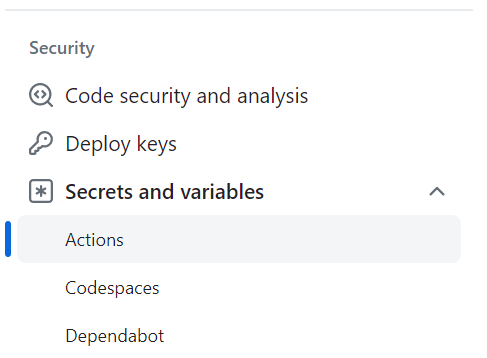
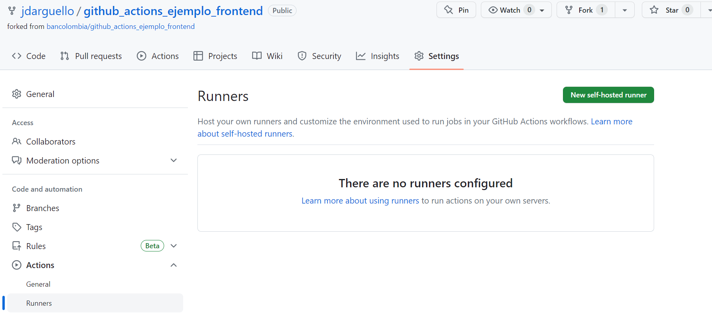

# Introducción a GitHub Actions

En el presente repositorio, se presenta un ejemplo de desarrollo frontend. El objetivo es la construcción de dos pipelines con GitHub Actons para la automatización en ambientes `dev` (GitHub Runners) y `prod` (Self-hosted Runner).

Para la construcción y ejecución de los pipelines, debes crear un __fork__ de este repositorio y trabajar sobre la rama _feature/login_. Si deseas consultar el __resultado final__ del pipeline que construiremos, puedes apoyarte en la rama _solution_.


<details id=0>
<summary>Despliegue DEV</summary>

Para el ambiente `dev` se aplicará un enfoque tradicional de automatización para desarrollos __Open Source__. Es decir, construiremos un pipeline cuyo runner base proviene de la base de GitHub (__Ubuntu__, Windows o MacOS). Adicional, aplicaremos variables de entorno locales de los pipelines y globales en todo el repositorio GitHub. El presente despliegue se divide en la siguiente estructura ("Jobs").

1. Testing: corrobora la calidad del código.
2. Build: genera y almacena los artefactos frontend.
3. Deploy: descarga y despliega los artefactos.

Para este ejemplo, el pipeline de `dev` se espera que se ejecute cada vez que se actualice alguna rama de tipo `feature/*`. Adicional, declararemos las variables de entorno a utilizar dentro del pipeline. De este modo, arrancamos la construcción del pipeline (que para este ejemplo, podríamos llamarlo `.github/workflows/deploy-dev.yaml`) de la siguiente forma:

```YAML
name: desplegar front en dev
on:
  push:
    branches:
      - feature/*

env:
  node-version: 18.16.0
  angular-version: 12.2.18
  cashify-version: 0.0.1
  s3-bucket: cashify-dev
```

Para el registro de los `jobs`, se empleará la siguiente estructura base:

```YAML
jobs:
    test:
        ...
    build:
        ...
    deploy:
        ...
```


### 1. Testing Job

Esta sección busca garantizar la calidad de código. Por lo que haremos que el pipeline descargue el código fuente, instale las dependencias base, ejecute los test unitarios y genere un reporte de cobertura.

```YAML
test:
    runs-on: ubuntu-latest
    defaults:
      run:
        working-directory: src
    steps:
      - name: Checkout
        uses: actions/checkout@v3
      - name: Instalar node.js
        uses: actions/setup-node@v3
        with:
          node-version: ${{ env.node-version }}
      - name: Instalar Angular
        run: npm i @angular/cli@${{ env.angular-version }}
      - name: Instalar paquetes
        run: npm i
      - name: Test unitarios
        run: npm run test:prod
```

Para la ejecución de este pipelines, se especificó la carpeta de ejecución de comandos base para cada _step_ (`working-directory`). Además, se emplearon dos _Actions_ comunitarios:

* __actions/checkout@v3__: descarga el código fuente del fork.
* __actions/setup_node@v3__: instala node.js en el runner del pipeline para la instalación de dependencias y ejecución de comandos Angular.


### 2. Build Job

El objetivo de este job consiste en compilar el código fuente del proyecto Angular para generar los artefactos y almacenarlos para su distribución.

```YAML
build:
    runs-on: ubuntu-latest
    needs: test
    defaults:
      run:
        working-directory: src
    steps:
      - name: Checkout
        uses: actions/checkout@v3
      - name: Instalar node.js
        uses: actions/setup-node@v3
        with:
          node-version: ${{ env.node-version }}
      - name: Instalar Angular y dependencias
        run: |
          npm i @angular/cli@${{ env.angular-version }}
          npm i
      - name: Build proyecto Angular
        run: npm run build
      - name: Generar archivo zip
        run: |
          zip -r ../dist.zip ../dist
      - name: Guardar artefacto
        uses: actions/upload-artifact@v3
        with:
          name: cashify-${{ env.cashify-version }}
          path: dist.zip
```

<details id=1>
<summary><h3>3. Gestión y configuración de recursos de AWS</h3></summary>

Para los siguientes jobs, necesitaremos configurar previamente algunos recursos de AWS para el despliegue de artefactos. Siendo estos:

* IAM User.
* S3 Bucket.

#### 3.1. IAM User

Lo primero que debemos hacer es habilitar un usuario de AWS que cuente con las políticas de edición, creación y eliminación de Buckets en S3, como se muestra en las Figuras 1 y 2.


<p style="text-align:center"><i>Figura 1.</i> Creación de usuario IAM.</p>


<p style="text-align:center"><i>Figura 2.</i> Política IAM.</p>

Luego de crear el usuario, debemos genrarle credenciales de acceso como se muestra en la Figura 3.


<p style="text-align:center"><i>Figura 3.</i> Creación del <i>Access Key</i>.</p>

Finalmente, se deben guardar las credenciales en algún archivo de texto para almacenarlas en los secretos de GitHub.


#### 3.2. S3 Bucket

Ahora, sólo debemos crear un bucket en S3 para el despliegue de los artefactos frontend, como se muestra en la Figura 4.


<p style="text-align:center"><i>Figura 4.</i> Creación del bucket S3.</p>

</details>

<details id=2>
<summary><h3>4. Registro de secretos en el repositorio GitHub.</h3></summary>

Ahora que están configurados los recursos de arquitectura nube requeridos (ver capítulo 2), el siguiente paso será almacenar la metadata en los secretos de GitHub. Lo primero, será acceder a la sección de configuración del __fork__ en GitHub, como se muestra en la Figura 5.


<p style="text-align:center"><i>Figura 5.</i> Settings del fork en GitHub.</p>

De allí, se debe buscar de __Secrets and variables__, en la sección de _Security_, como se muestra en la Figura 6. 


<p style="text-align:center"><i>Figura 6.</i> Sección de secretos en GitHub.</p>

En esta sección se registran las variables de acceso a AWS, como se muestra en la Figura 7.


<p style="text-align:center"><i>Figura 7.</i> Secretos registrados.</p>

</details>

### 5. Deploy Job

Este _job_ requiere el complemento de todos los capítulos anteriores. Busca desplegar los artefactos construídos en el capítulo 2 en los recursos nube configurados. El primer paso consiste en la conectar el pipeline con la cuenta AWS configurada en el capítulo 3. Luego se descarga y se descomprimen los archivos del artefacto descargado. Finalmente, se suben los archivos al bucket S3 configurado en el capítulo 4.

```YAML
deploy: 
    runs-on: ubuntu-latest
    needs: build
    steps:
      - name: Configurar credenciales de AWS
        uses: aws-actions/configure-aws-credentials@v2
        with:
          aws-access-key-id: ${{ secrets.AWS_ACCESS_KEY_ID }}
          aws-secret-access-key: ${{ secrets.AWS_SECRET_ACCESS_KEY }}
          aws-region: us-east-1
      - name: Descargar artefacto
        uses: actions/download-artifact@v3
        with:
          name: cashify-${{ env.cashify-version }}
      - name: Unzip artefacto
        uses: montudor/action-zip@v1
        with:
          args: unzip -qq dist.zip -d .
      - name: Desplegar artefacto en S3 dev
        run: aws s3 cp ./dist/cashify/. s3://${{ env.s3-bucket }} --recursive
```

</details>

<details id=3 open>
<summary>Despliegue PROD</summary>

El ambiente `prod` emplea un enfoque de desarrollo __InnerSource__. Es decir, el pipeline se ejecuta dentro de una máquina virtual personalizada (EC2 en AWS) que puede estar conectado con las configuraciones de seguridad y de red (VPC/subnets y VPN). El primer paso consiste en configurar el runner de GitHub con la instancia de servidor EC2. Una vez configurado el runner, los pasos siguientes serían muy similares a la del despliegue `dev`; con la diferencia de que ya no es necesario evaluar la calidad de código, dado que ya ha sido cubierto desde el despliegue anterior.

### 1. Self-hosted Runner
Lo primero que se debe hacer es crear el runner desde el repositorio/fork en GitHub (sección de _settings_), como se muestra en la Figura 8.


<p style="text-align:center"><i>Figura 8.</i> Settings.</p>

Al crear un nuevo runner, se mostrará una lista de comandos a correr en la terminal del servicio EC2 para que se configure como un _self-hosted runner_ de GitHub y poder ser utilizado dentro de los pipelines de GitHub Actions. Dichos pasos se pueden apreciar en la Figura 9.


<p style="text-align:center"><i>Figura 9.</i> Configuración del runner.</p>

</details>